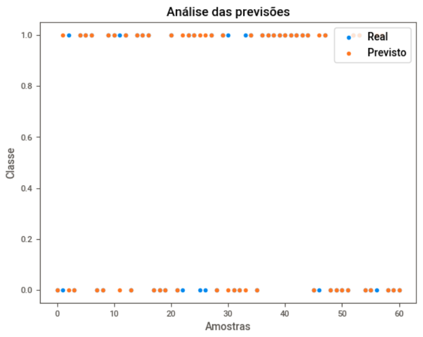

# Classificação de Doenças Cardíacas com o Classificador Random Forest


Bem-vindo a este projeto de classificação de doenças cardíacas! Este repositório contém um script em Python que utiliza um Classificador Random Forest para prever a probabilidade de ocorrência de doenças cardíacas com base em dados clínicos. Este guia detalhado irá ajudá-lo a entender e executar o código.

## Instalação
Antes de começar, certifique-se de ter instalado as bibliotecas Python necessárias. Você pode fazer isso utilizando o pip:
```bash
!pip install sweetviz
```

## Visão Geral do Projeto
Este projeto é dividido em várias etapas essenciais:

### Carregamento e Análise de Dados:

- Importe as bibliotecas necessárias para análise de dados, treinamento e visualização:

``` python
import pandas as pd
import sweetviz as sv
from sklearn.model_selection import train_test_split
from sklearn.preprocessing import MinMaxScaler
from sklearn.ensemble import RandomForestClassifier
from sklearn.metrics import accuracy_score
import matplotlib.pyplot as plt
```

- Carregue o conjunto de dados de doenças cardíacas com o seguinte código:

```python
data = pd.read_csv("/content/heart.csv")
```

- Analise o conjunto de dados com SweetViz para obter informações valiosas:

```python
sw = sv.analyze(data, target_feat="output")
sw.show_html()
```


## Pré-processamento dos Dados:

- Separe o conjunto de dados em características (X) e a variável alvo (y):

```python
x = data.drop("output", axis=1)
y = data["output"]
```

- Divida os dados em conjuntos de treinamento e teste para avaliação do modelo:

```python
x_treino, x_teste, y_treino, y_teste = train_test_split(x, y, test_size=0.2, random_state=42)
```

- Normalize as características utilizando a escala Min-Max para melhorar o treinamento:

```python
scaler = MinMaxScaler()
x_treino_normalizado = scaler.fit_transform(x_treino)
x_teste_normalizado = scaler.transform(x_teste)
```

## Treinamento do Modelo:

- Crie e treine um Classificador Random Forest para fazer previsões precisas:

```python
clf = RandomForestClassifier()
modelo_rf = clf.fit(x_treino_normalizado, y_treino)
```
## Avaliação do Modelo:

- Use o modelo treinado para fazer previsões e avaliar o desempenho com base na precisão:

```python
previsoes = modelo_rf.predict(x_teste_normalizado)
precisao_rf = accuracy_score(y_teste, previsoes)
print("Precisão do Modelo Random Forest: {:.2%}".format(precisao_rf))
```
```
>>> Acertividade do modelo de RandomForest: 83.61%
```
- A pontuação de precisão reflete a capacidade do modelo em prever a presença de doenças cardíacas.

## Visualização dos Resultados:

- Visualize as previsões em relação aos valores reais para uma melhor compreensão do desempenho do modelo:

```python
plt.scatter(range(len(y_teste), y_teste, label='Real')
plt.scatter(range(len(previsoes), previsoes, label='Previsto')
plt.title('Análise das Previsões')
plt.xlabel('Amostras')
plt.ylabel('Classe')
plt.legend(loc='upper right')
plt.show()
```



## Conclusão
Este projeto fornece um roteiro abrangente para classificar a probabilidade de doenças cardíacas usando um Classificador Random Forest. Você pode adaptar o código ao seu conjunto de dados específico e personalizá-lo conforme necessário. Boa sorte no seu projeto de classificação de doenças cardíacas e na busca por insights valiosos a partir dos dados clínicos!
